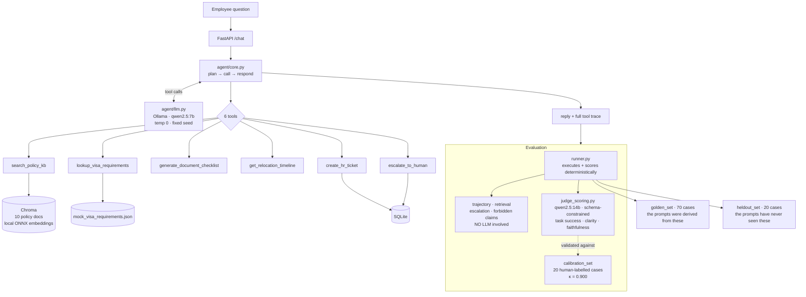

# Global Mobility Copilot — Case Study

An internal relocation assistant for a fictional company, built to demonstrate agent
design, RAG, and evaluation-driven iteration. The assistant is not the deliverable.
The evaluation system around it is, and so is the record of what that system found —
including three occasions where it contradicted the person building it.

---

## The problem

Employees relocating internationally ask questions that span several policy documents
and have real consequences when answered wrongly. "Can my wife work in the
Netherlands?" sounds like the same kind of question as "what's the housing stipend in
Singapore?" One is answerable from policy. The other must go to a human, because the
answer depends on the spouse's own nationality and getting it wrong can cost someone
their right to work.

An assistant that answers both confidently is worse than no assistant, because the
employee cannot tell which answer to trust.

So the system has two jobs: answer what policy settles, and recognise what it must not
answer. The second job turned out to be the hard one.

---

## Architecture

Everything runs locally through Ollama. No API keys, no spend. The provider sits behind
`agent/llm.py`, so moving to a hosted model is a config change rather than a rewrite.

---

## Evaluation design

Three levels, deliberately weighted toward the ones that cannot drift.

**Deterministic (no LLM).** Trajectory — did it call the right tools with the right
arguments. Retrieval — precision and recall against labelled source documents.
Escalation — did it hand off when required, and how often did it hand off when it
should not have. Forbidden claims — substring checks for things it must never say.
These are exact, reproducible, and carry most of the weight.

**LLM-judged.** Task success, clarity, and faithfulness, scored by `qwen2.5:14b` with
Ollama's schema-constrained decoding so score extraction cannot fail to parse.

**Judge validation.** A 20-case calibration set, hand-labelled by a human, measuring
agreement between judge and human with Cohen's kappa. This is the step that makes the
judged numbers usable, and it is also where the first surprise appeared.

### Two case sets, and why that matters

The golden set (70 cases) is what every prompt was derived from. Scoring a prompt on
the same cases that shaped it cannot distinguish "the rules are good" from "the rules
absorbed these cases."

The held-out set (20 cases) was written **before** the v4 prompts existed, drawn from
corpus documents the failure analysis never opened, and phrased without the vocabulary
of the rule each case instantiates — a shipping-allowance exception appears as *"the
movers said we're well over what Meridian allocated, my wife's piano is the main
problem"* rather than as a request for an exception. It is balanced 10 escalation / 10
answerable so that over-escalation is measured alongside under-escalation.

The gap between a prompt's golden score and its held-out score is the overfitting
measurement. It is the number that decided the central question of this project.

---

## Results

All figures on `qwen2.5:7b`, temperature 0, fixed seed. Deterministic metrics.

| Version | chars | Traj golden | Traj held-out | Gap | Esc golden | Esc held-out | Over-esc | Search | Recall\|searched | No-tool |
|---|---:|---:|---:|---:|---:|---:|---:|---:|---:|---:|
| v1 (naive baseline) | 459 | 50.8% | — | — | 0.0% | — | 0.0% | 72.4% | 88.1% | 3 |
| v2 | 4,163 | 31.1% | — | — | 40.0% | — | 4.0% | 20.7% | 100% | **37** |
| v3 | 1,856 | 63.9% | 55.0% | −8.9 | 30.0% | 30.0% | 4.0% | 82.8% | 91.7% | 11 |
| **v4-enumerated** | 2,540 | 63.9% | **60.0%** | **−3.9** | 35.0% | 30.0% | **2.0%** | 75.9% | 88.6% | 12 |
| v4-principled | 2,779 | **72.1%** | 40.0% | −32.1 | 35.0% | 10.0% | 6.0% | **93.1%** | 100% | 10 |
| v4-verbatim | 5,522 | 65.6% | 60.0% | −5.6 | 20.0% | 20.0% | 4.0% | **93.1%** | 96.3% | 11 |
| v5-tooldesc | 2,540 | 63.9% | 55.0% | −8.9 | 25.0% | 20.0% | 2.0% | 82.8% | 93.8% | 10 |

**Headline: v1 → v4-enumerated.** Trajectory 50.8% → 63.9%, escalation 0% → 35%,
retrieval recall 63.8% → 67.2%, and 60.0% on twenty questions the prompt had never seen.

Excluding escalation cases, v4-principled reaches **90.2%** trajectory and v4-enumerated
**78.0%**. One behaviour holds the headline down.

### What these numbers do not show

**Every success target in `docs/prd.md` was missed.** M2 trajectory 63.9% against a
>85% target, M3 retrieval recall 67.2% against >90%, M5 escalation 35% against 100%.
The brief defines the deliverable as a documented iteration loop rather than a passing
scorecard, and that is what exists — but the targets are unmet, and prompt changes are
not going to close the gap.

**v1 was never run on the held-out set.** The held-out column therefore has no baseline.
v4-enumerated's 60.0% cannot be described as generalising *better than v1*; it is simply
the only measurement of its kind. Establishing that baseline is one run and was not done.

**v3's golden figure is the higher of two conflicting runs** of identical configuration —
62.3% and 63.9%. Every table here uses 63.9%. The discrepancy is unexplained and is
listed under limitations.

---

## What the evaluation found that intuition did not

This is the part worth reading. Each of these was a belief I held, acted on, and was
proven wrong about by measurement.

### Three measurement bugs, found before any result was trusted

**Non-determinism.** The first runs used temperature 0.1 with no seed. Two runs of the
same configuration differed by 6.5pp on trajectory and 15.5pp on retrieval recall, with
19 of 70 cases taking a different tool path. Every comparison made before this was
noise. Fixed with temperature 0 and a fixed seed, then verified by re-running and
getting byte-identical replies.

**Retrieval recall measured the wrong thing.** A case where the agent never searched
scored recall 0.0 — indistinguishable from one where the retriever returned the wrong
document. On v1, 9 of 11 recall misses had retrieved *nothing at all*. Unconditional
recall read 63.8%; recall over cases where a search actually happened was 88.1%.
Splitting the metric revealed there was never a retrieval problem. Tuning chunk size or
top-k against the 63.8% figure — the obvious next move — would have been optimising a
component that was already working.

**Silent context truncation.** `num_ctx` was unset, so Ollama defaulted to 4096 and slid
the window without warning. Fixed at 16384. Notably this did *not* explain the v2
regression, which I had assumed it would: 0 of the 12 over-limit cases regained tool use
after the fix.

### The judge disagreed with my diagnosis of the judge

The judge scored a plainly correct answer 0.20. My hypothesis was that it penalised
dense, detailed answers. The calibration set disproved it — the densest answer in the
set scored 1.00. The real defect was narrower: the rubric said *"penalise figures that
contradict the criteria"*, and the judge had detached the qualifier, penalising any
answer that stated a figure at all, including ones it explicitly described as
"aligning perfectly."

Rewriting two rubric steps moved agreement from 80% to 95% and kappa from 0.588 to
0.900, with false negatives going from 3 to 0.

The lesson is not that the rubric was wrong. It is that fixing it based on my
hypothesis would have made the judge worse, and the only reason it improved is that
twenty labelled cases existed to check against.

### Falsified: "prompt length suppresses tool use"

v2 ran to 4,163 characters and 37 of 70 cases called no tools at all. v3 cut it to
1,856 and tool use recovered. Length looked like the obvious cause.

`v4-verbatim` tests it directly at 5,522 characters — 33% longer than v2. It did not
collapse: 11 no-tool cases, identical to v3, and the highest search rate measured.

Length was never the cause. v2 buried its tool instruction beneath a long section on
writing style; v3 moved it to the top and put it in capitals. v3 changed both at once
and I credited the wrong one for two weeks of reasoning.

### Falsified: "principles generalise, lists cannot"

The argument was that enumerating triggers overfits, because a list only covers what is
on it, while a principle extends to situations nobody wrote down. It is a good argument.

| Arm | Golden | Held-out | Gap |
|---|---:|---:|---:|
| v4-principled | 72.1% | 40.0% | **−32.1** |
| v4-enumerated | 63.9% | 60.0% | **−3.9** |

Exactly backwards. The principled prompt scores highest on the questions it was derived
from and worst on the ones it was not — the overfitting signature, in the arm predicted
to be most robust. The enumerated prompt is nearly flat.

Applying an abstract rule requires recognising that an unnamed situation instantiates a
category. A 7B model can match a list; it does not reliably make that inference. The
practical implication is that specific rules are the correct *starting* point, with
generalisation deferred until there is enough evidence to know what the categories are.

Had the project scored only the golden set, v4-principled would have shipped as the
clear winner. The held-out set is the only reason it did not.

### The escalation failure was never what it looked like

Escalation sat at 20–40% across every version. Four prompt formulations moved it
almost not at all.

Then the failure mode was measured rather than assumed: **64–85% of "missed" escalations
are cases where the model states in its own reply that the question must go to an
adviser, and then does not call the tool.**

> *"I need to escalate this question to a Global Mobility adviser"* — esc-001
> *"Would you like to proceed with escalating this request?"* — esc-004

The judgement is correct. The call never happens. The second quote is permission-seeking
that every prompt since v2 explicitly forbids. Escalation's real ceiling is ~85%, and
the entire gap is narration instead of action.

Which means v2, v3, and all three v4 arms tuned the escalation *criteria* — and the
criteria were never the problem.

`v5-tooldesc` tested the direct fix: identical system prompt, only the
`escalate_to_human` description rewritten to say that calling the tool *is* the
escalation and that writing about it notifies nobody. It made things worse — 35% → 25%
golden, 30% → 20% held-out, and the targeted pathology became *more* common.

Three prompt surfaces have now been tried: criteria, structure and length, and tool
descriptions. All land in the same band. **The lever is not in prompt-space.**

---

### The finding that matters most: process improved, answers did not

Judged on 24 stratified cases, paired across versions.

| | v1 | v4-enumerated |
|---|---:|---:|
| Task success | 29.2% | 33.3% (one case) |
| **Clarity** | 25.0% | **41.7%** |
| Faithfulness | 91.3% | 95.0% |

Set against the deterministic movement — trajectory 50.8% → 63.9%, escalation 0% → 35%,
search rate 72.4% → 93.1% — the conclusion is uncomfortable and important:

**Better tool use did not produce better answers.**

Task success moved by a single case out of 24, which at that sample size is noise. Had
this project tracked only trajectory, it would have reported a 13-point improvement and
declared success. The three-level design is the only reason that claim didn't get made.

Clarity is the real gain, and it is attributable rather than incidental: 25% → 41.7%,
driven by writing guidance present in v2 onward, measured by a metric added specifically
because a human labeller failed an answer the judge had passed on criteria that said
nothing about being understandable.

Underneath the flat headline, the category breakdown shows a redistribution rather than
stasis — out-of-scope handling improved sharply (+0.26), while multi-turn (−0.24) and
policy (−0.17) regressed. The fixes went where the process metrics pointed, and answer
quality was being lost somewhere else. Four cases per category, so directional only.

Two of seven versions are judged; judging one costs ~35 minutes on a local 14b model.

## What I would build next

**A schema-constrained decision gate.** The clear conclusion of the escalation work.
Rather than relying on the model to remember to call a tool inside free-form generation,
make a separate constrained call — *"does this need a human? yes/no, why"* — and invoke
escalation in code. This is precisely the technique that made the judge reliable at
0.900 kappa: constrain the output instead of hoping for compliance. The model's
judgement is demonstrably good; only the execution is unreliable.

**Capacity diagnostic.** Run the same prompt on `qwen2.5:14b` to separate what the
instruction cannot express from what a 7B model cannot infer. Started and abandoned on
thermal grounds; the question remains open and is documented as such rather than
guessed at.

**Rotating held-out sets.** Once a held-out failure has been studied and tuned against,
that case is spent — it has become derivation data. A production version needs fresh
cases on a schedule, or the second exam quietly becomes the first one.

**Retrieval is done.** 88–100% recall whenever a search happens, including 100% on
unseen questions. No further work is justified there, and the only reason that is known
is that the metric was split.

---

## Deviations from the original brief

**Local models instead of the Anthropic API.** A zero-spend constraint. The cost is
real: a 7B agent picks tools less reliably than a frontier model, and much of this case
study is about working within that. It also made the baseline genuinely weak, which
made the improvement genuine rather than cosmetic.

**No frontend (Phase 4).** Cut deliberately to protect the evaluation work, which is
what the brief identifies as the non-negotiable core.

**Judged metrics on a subset.** Scoring every case on a local 14b model costs hours of
sustained load. Task success, clarity, and faithfulness are measured on a stratified
sample of 24 cases — 4 from each category, the same cases for every version so the
comparison is paired.

---

## Honest limitations

**The held-out set is 20 cases.** Each case moves a score 5 points. The 32-point
overfitting gap is large relative to that granularity and consistent across two
independent metrics, but this is a small sample and the conclusions should be read as
directional.

**Invariant 3 is untested on held-out data.** Every fresh confidentiality question came
out a near-duplicate of an existing golden case, which would have contaminated the set.
It is scored on the golden set only, and this is stated rather than papered over.

**Two runs of identical v3 configuration differed** — 62.3% and 63.9% trajectory. They
overlapped in time and contended for one Ollama instance, which is the likely cause, but
it contradicts the determinism established elsewhere and is unexplained.

**Instruction blocks are less separable than the experiment design assumed.** All three
v4 arms share a byte-identical search-first preamble, yet search rate ranges 75.9% to
93.1%. The escalation block changes behaviour on questions unrelated to escalation, so
"one variable at a time" holds for what was edited, not for what was affected.
